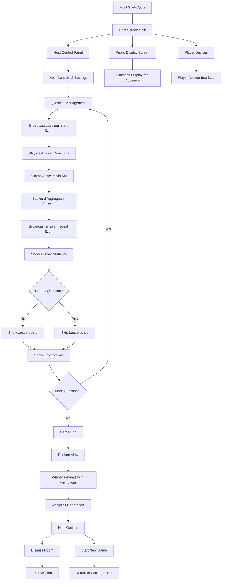

# TUIZ Quiz Game Flow Chart

This document outlines the complete game flow procedure as described in the Master_Prompt.md.

## Game Flow Overview



## Detailed Game Flow

### 1. Pre-Game Phase

```
Host Waiting Room
├── Room Code Display
├── Player List Management
├── Room Lock/Unlock Controls
├── Game Settings Configuration
└── Start Game Confirmation Modal
```

### 2. Game Start Phase

```
Host Confirms Start
├── Host Screen Splits:
│   ├── Host Control Panel (Private)
│   │   ├── Question Controls
│   │   ├── Timer Management
│   │   ├── Answer Reveal Controls
│   │   └── Game Settings
│   └── Public Display Screen
│       ├── Question Content
│       ├── Answer Choices
│       ├── Timer Display
│       └── Results Display
└── Player Devices
    ├── Answer Interface
    ├── Timer Display
    └── Results View
```

### 3. Question Loop Phase

```
For Each Question:
├── Question Display
│   ├── Host Control Panel: Question Management
│   ├── Public Screen: Question + Choices
│   └── Player Devices: Answer Interface
├── Answer Collection
│   ├── Players Submit via API
│   ├── Backend Aggregates Data
│   └── Real-time Answer Tracking
├── Answer Reveal
│   ├── Show Answer Statistics
│   ├── Reveal Correct Answer
│   └── Display Player Response Counts
├── Results Display
│   ├── Leaderboard (if not final question)
│   ├── Explanations (if available)
│   └── Score Updates
└── Next Question Check
```

### 4. Game End Phase

```
Final Question Complete
├── Skip Leaderboard (preserve suspense)
├── Show Final Answer + Explanation
├── Podium View
│   ├── Winner Reveals (one by one)
│   ├── Suspenseful Animations
│   ├── Sound Effects
│   └── Final Rankings
├── Analytics Generation
│   ├── Player Performance Data
│   ├── Question Difficulty Analysis
│   └── Session Statistics
└── Post-Game Options
    ├── Dismiss Room
    └── Start New Game
```

## Real-time Communication Events

### Event Flow

```
Host → Players: question_start
├── Question ID
├── Start Timestamp
└── Duration

Players → Host: answers_locked
├── Player ID
├── Answer Choice
└── Submission Timestamp

Host → Players: answer_reveal
├── Correct Answer
├── Answer Statistics
└── Explanation

Backend → All: leaderboard_update
├── Player Rankings
├── Current Scores
└── Progress Indicators
```

## Technical Implementation Notes

### Performance Requirements

- **Target Capacity**: 300-400 concurrent players
- **Latency Tolerance**: Up to 400ms
- **Auto-reconnect**: Fetch last_known_state on reconnection
- **Lightweight Events**: Minimize data transfer for player devices

### Data Flow

```
Player Answer → API Call → Database Insert
Backend Aggregation → Lightweight Summary Events
Real-time Broadcasting → All Connected Clients
```

### Screen Responsibilities

- **Host Control Panel**: Full game management, settings, controls
- **Public Display**: Question content, results, leaderboard (no controls)
- **Player Devices**: Answer interface, results, lightweight leaderboard

## State Management

### Game States

1. **Waiting**: Players joining, host preparing
2. **Question Active**: Question displayed, answers being collected
3. **Answer Reveal**: Showing correct answer and statistics
4. **Leaderboard**: Displaying current rankings (except final question)
5. **Explanation**: Showing question explanations
6. **Podium**: Final winner reveals and celebrations
7. **Complete**: Game ended, analytics available

### Transition Triggers

- Host actions (start question, reveal answers, next question)
- Timer events (question timeout, answer collection complete)
- Player actions (answer submission, reconnection)
- System events (game end, error handling)

## Error Handling & Recovery

### Connection Issues

- Auto-reconnect with state restoration
- Graceful degradation for high latency
- Offline mode for critical actions

### Game State Recovery

- Last known state endpoint
- Question replay capability
- Answer resubmission handling

This flow chart serves as the technical specification for implementing the TUIZ quiz game system, ensuring all components work together seamlessly for the festival environment.
