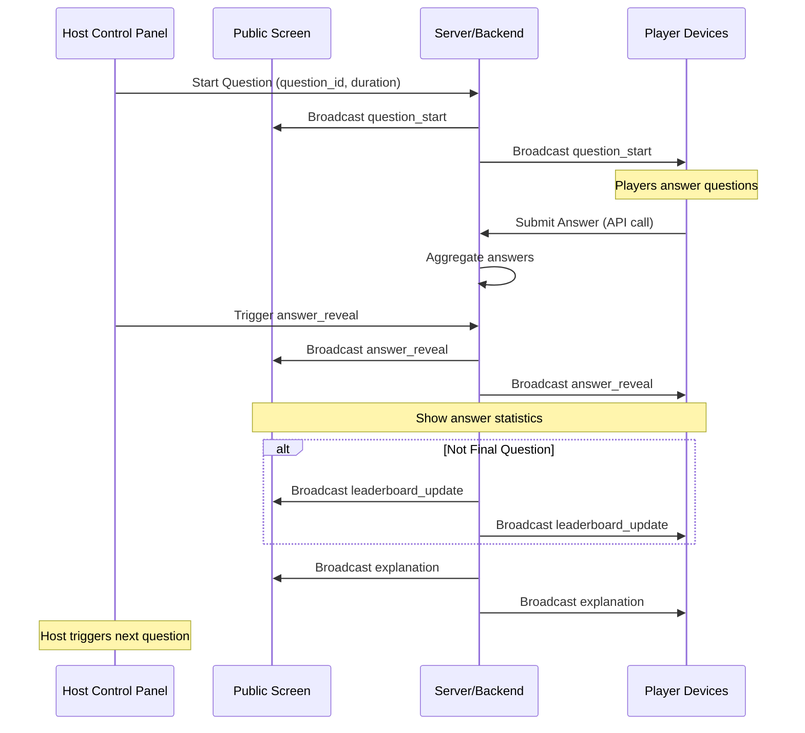
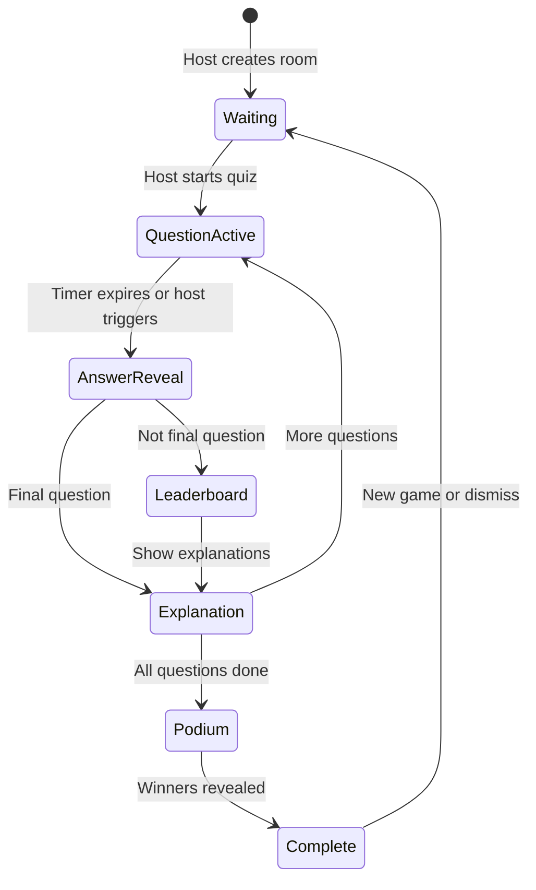

# Technical Game Flow Implementation

## Real-time Event Flow



## Screen Responsibilities

### Host Control Panel (Private)

- Question management controls
- Timer controls
- Answer reveal triggers
- Player management
- Game settings
- Analytics dashboard

### Public Display Screen (Audience)

- Question content display
- Answer choices (A, B, C, D)
- Timer countdown
- Answer statistics
- Leaderboard
- Explanations
- Podium view

### Player Devices (Mobile)

- Answer selection interface
- Timer display
- Results view
- Lightweight leaderboard
- Connection status

## Data Flow Architecture

```text
┌─────────────────┐    ┌─────────────────┐    ┌─────────────────┐
│   Host Control  │    │  Public Screen  │    │ Player Devices  │
│     Panel       │    │                 │    │                 │
└─────────┬───────┘    └─────────┬───────┘    └─────────┬───────┘
          │                      │                      │
          │                      │                      │
          ▼                      ▼                      ▼
┌─────────────────────────────────────────────────────────────────┐
│                    Server/Backend                              │
│  ┌─────────────┐  ┌─────────────┐  ┌─────────────┐            │
│  │   WebSocket │  │   Database  │  │   Analytics │            │
│  │   Manager   │  │   Layer     │  │   Engine    │            │
│  └─────────────┘  └─────────────┘  └─────────────┘            │
└─────────────────────────────────────────────────────────────────┘
```

## Game State Machine



## API Endpoints

### Question Management

- `POST /api/game/start` - Start quiz session
- `POST /api/game/question/start` - Start specific question
- `POST /api/game/question/reveal` - Reveal answers

### Player Actions

- `POST /api/game/answer` - Submit answer
- `GET /api/game/status` - Get current game state
- `GET /api/game/leaderboard` - Get current leaderboard

### Real-time Events

- `question_start` - Question begins
- `answer_reveal` - Answers revealed
- `leaderboard_update` - Rankings updated
- `game_end` - Quiz completed

## Performance Considerations

### Optimization Strategies

1. **Lightweight Player Events**: Minimal data for mobile devices
2. **Batch Processing**: Aggregate answers before broadcasting
3. **Connection Pooling**: Efficient WebSocket management
4. **Caching**: Store frequently accessed data
5. **CDN**: Static assets delivery

### Scalability Targets

- **Concurrent Players**: 300-400 per session
- **Response Time**: <400ms for critical actions
- **Uptime**: 99.9% during festival hours
- **Data Transfer**: Minimize bandwidth usage

## Error Handling

### Connection Recovery

```javascript
// Auto-reconnect with state restoration
const reconnect = async () => {
  const lastState = await fetch('/api/game/status');
  // Restore game state
  // Resume from last known position
};
```

### Graceful Degradation

- Offline mode for answer submission
- Cached leaderboard data
- Fallback UI for connection issues
- Retry mechanisms for failed requests

## Security Considerations

### Data Protection

- Player answer encryption
- Secure WebSocket connections
- Rate limiting on API endpoints
- Input validation and sanitization

### Anti-Cheating

- Server-side answer validation
- Timestamp verification
- Connection monitoring
- Suspicious activity detection

This technical flow provides the implementation roadmap for building the TUIZ quiz game system with proper real-time communication, state management, and performance optimization.
